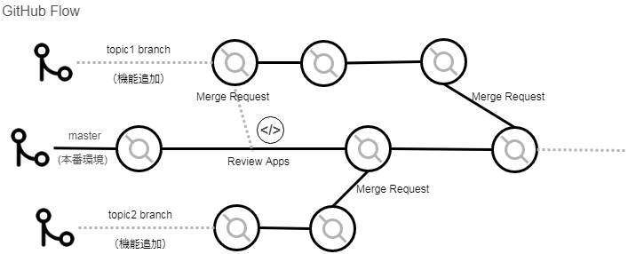
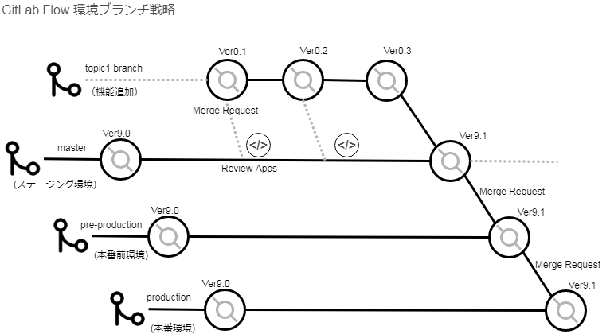
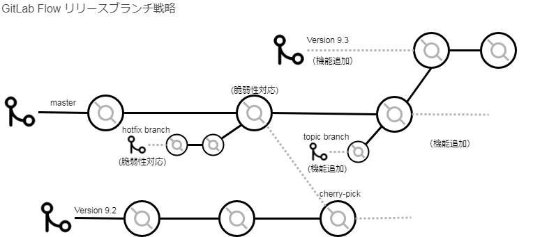

#### 本リポジトリについて
本リポジトリは、個人学習用のためのものです。  
以下に記載する参考書籍を引用しております。
(引用方法や内容が不適切である場合には、非公開設定にします)

# Gitを使用した開発フロー
開発に使用する以下のフローを記載

* GitHub Flow
* GitLab Flow 環境ブランチ戦略
* GitLab Flow リリースブランチ戦略

## 参考書籍、引用書籍
* [GitLab 実践ガイド DevOpsワークフローの導入と運用](https://www.amazon.co.jp/GitLab%E5%AE%9F%E8%B7%B5%E3%82%AC%E3%82%A4%E3%83%89-impress-top-gear%E3%82%B7%E3%83%AA%E3%83%BC%E3%82%BA-%E5%8C%97%E5%B1%B1-ebook/dp/B079DL362C)
 
書籍の説明図をdrawioで写経しています。
[draw.ioについて](https://github.com/yaya-io/Study-drawio-1/blob/master/README.md)

## GitHubFlow

> GitHub Flowでは、機能ブランチ(Feature Branch)と Masterブランチ(Master Branch)のみを利用する。
> 1. Masterブランチから個別の機能修正や新機能実装といった名前の機能ブランチを作成してローカルで開発
> 1. 開発後に機能ブランチをローカルでコミットし、サーバー上の同盟のブランチにプッシュ
> 1. プッシュと同時にテストが行われ、レビューを行うためにPull Requestを作成
> 1. レビュー後にMasterブランチにマージし、動的にリリースする

## GitLab Flow 環境ブランチ戦略

> GitLab Flow(環境ブランチ戦略）は、環境ごとにブランチを用意し、各環境でのMergerequestが通ったものから、上位の環境に動的にデプロイを行う仕組み。
> 1. 機能開発するときは、Masterブランチから機能ブランチを作成して開発を行う
> 1. 開発後に、機能ブランチからMasterブランチに対してMergeRequestを作成する
> 1. Masterブランチをテスト環境へデプロイして確認を行う
> 1. MasterブランチからステージングブランチへのMergeRequestを作成し、マージと同時にステージングへのデプロイを行う
> 1. ステージングブランチから本番ブランチへのMergeRequestを作成し、マージと同時にリリースを行う

## GitLab Flow リリースブランチ戦略

> GitLab Flow(リリースブランチ戦略）は、ソフトウェアを開発するときに、リリースに対してブランチを用意する仕組み。
> 基本はMasterブランチ上（アップストリームバージョン)で新規機能開発を進め、バージョンごとに別ブランチを作成してリリースを行う。
> 各バージョンのブランチ内容は、そのバージョン内で閉じており、重大なバグフィックスだけをMasterブランチから取り入れていく。（アップストリームファーストポリシー）

